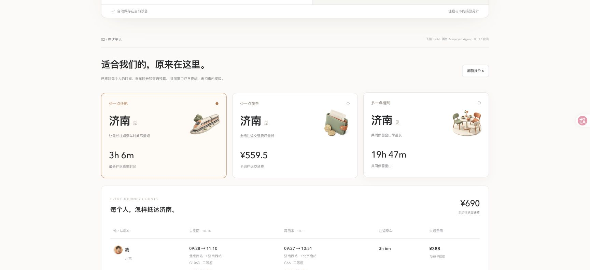
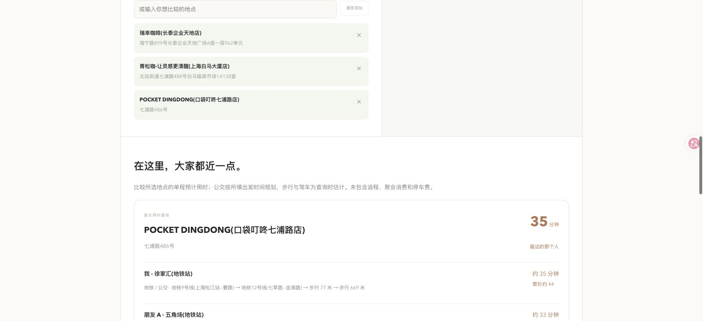

# 中点见 · Meet Halfway

**把时间留给相聚。** 为 2–4 位朋友比较同城与跨城会合方案，让最远的那个人少迁就一点。

[在线体验](https://zhongdianjian.super666joey.workers.dev) · [参赛材料](docs/submission.md) · [架构与配置](docs/architecture.md)

## 两种见面方式

- **跨城见面**：输入国内中文城市名、每个人的出发和回家时间、往返交通预算与乘车上限；在所选候选城市和真实返回车次中比较「最长乘车者负担最小」「总交通费最低」「共同停留窗口最长」。支持自然语言修改条件、重新计算和酒店查询。
- **同城碰面**：先搜索并确认每个人的出发地点，再比较候选咖啡店等地点的真实公交、步行或驾车预计时间。同在上海的朋友，也可能相距几十公里。




截图来自 2026-10-09 公网真实查询，使用公开地标和演示人物。数值是查询时的报价与预计时间，不是当前预订承诺。美术插画由 AI 生成，不是实际目的地或用户照片。

## 百炼位于运行时核心链路

网页 → 服务端校验 → **阿里云百炼 Managed Agent / Qwen3.8-Flash** → 飞猪官方 Skill / FlyAI CLI → 校验工具输出 → 确定性筛选和排序。

旅行 Agent 在云端执行往返车次和酒店查询。文字 Agent 不挂工具、不接收旅行密钥，负责理解条件及选择讨论重点。金额和时间事实由程序计算，模型生成的票价不能成为报价来源。高德 Web 服务提供同城地点和路线。

## 体验步骤

1. 打开在线体验，选择「跨城」或「同城」。
2. 跨城示例：北京、天津出发，候选济南；选择未来可售日期，预算各 800 元。检查个人时间限制后查询。首次建议只选 1–3 个候选城市，云端真实查询可能需要数分钟。
3. 同城示例：上海，搜索并确认徐家汇、五角场地铁站，选择公交，再比较候选地点。
4. 修改某人的预算或时间，重新比较。条件修改后旧方案失效；无满足条件的结果会显示具体原因。

演示有频率和总调用额度限制；接口超时、无票、额度不足会明确报错，不以样例冒充实时数据。

## 本地复现

需要 Node.js 22+，以及自己的百炼 Managed Agent、飞猪和高德服务凭据。

```sh
npm ci
cp .env.example .env.local
# 按 docs/architecture.md 配置服务端环境变量
npm run dev
```

访问 http://127.0.0.1:3088 。未配置凭据时仍可查看界面、填写条件，真实查询会明确提示缺少配置。

```sh
npm test
npm run typecheck
npm run build
npm start
```

生产运行代码与已部署版本一致；公开仓库移除了云账户标识、凭据和本地运行记录。保留两份公开测试数据供回归测试；它们不会用于在线查询兜底。

## Cloudflare 部署

1. 创建自己的 D1 数据库，将 `wrangler.jsonc` 的 `YOUR_D1_DATABASE_ID` 替换为自己的 ID。
2. 执行 `npx wrangler d1 migrations apply zhongdianjian-budget --remote`。迁移保留原演示的保守额度种子，供复现使用；已有服务不能清空计数来绕过调用上限。
3. 使用 Cloudflare Secrets 设置 `.env.example` 中的服务端凭据和 Managed Agent 配置，不要放入前端或公开配置。
4. `npm run build:cloudflare`，再 `npm run deploy:cloudflare`。
5. Worker 专用类型可用 `npx wrangler types` 生成，再执行 `npx tsc -p cloudflare/tsconfig.json --noEmit`。

线上 D1 原子记录额度、查询锁和短期比较结果。默认应用总预留上限 200 元；这是保守调用预算，不是云服务实际账单或计费硬限额。

## 可核验范围

- 51 项自动测试通过，包含硬约束、价格异常、跨日时间、条件修改、工具调用核验、额度原子扣减和同城路线比较。
- 真实公网跨城与同城运行记录见 `evidence/`。尚未完成 5 人用户研究，因此没有节省时间、满意度或转化率结论。
- 跨城当前为两天一夜、直达铁路；共同窗口包含夜间，按车站时间计算，未扣市内接驳。住宿报价另列；库存未知不等于有票。
- 同城排序只覆盖本次候选地点；公交按指定时间规划，步行/驾车为查询时估计。不声称全国、全城或所有车次的全局最优。
- 不自动订票、下单或付款。各数据服务与依赖受其原有条款约束。本仓库公开用于作品展示和复现，未另行授予开源许可证。
